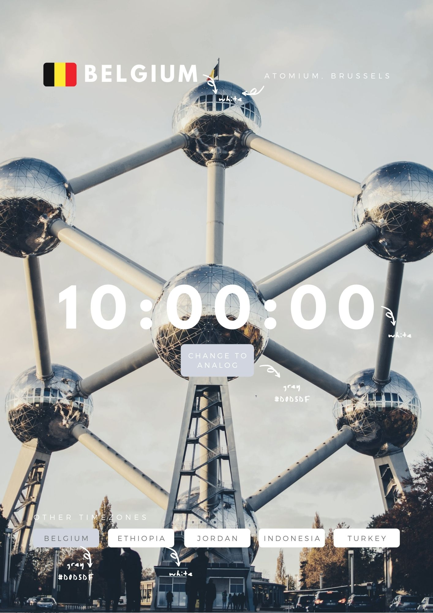
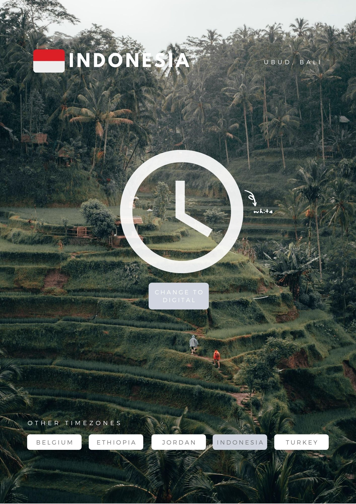

# Development Strategy

## Wireframes

## 0. Initial
- Create a ReadME file
- Create Development Strategy MD

**SetUp**
- Create master boiler index html
- Create branches per user story (4 branches)
- Add assest for each user story

## 1. User Story 1: Display of the Header (Homepage)
As a user; I want to see a well styled webpage.

DOM
- Create a parent Div.  
- Create the buttons on the homepage
- Create the headers `<h1>`.

Styles
- Add the main css for the UI

Function Js
- Add function to display the Homepage, default country 

Listener Js
- Add eventlistner to the homepage country(Belgium)

## 2. User Story 2: Display the Digital Clock at Homepage
As a user; I want to see a digital clock that counts according to the timezone of the country where am at now(Belgium).

 Function JS
 - write Digital clock function that runs the sets up the logic

 Listner JS
 - Add an eventListner on the deafualt page button 

## 3. User Story 2: Display Button for each country
As a user, I want to see each country with it's own country buttons

DOM
 - button for each country

 Style
  - Add style to the headers of each country

 Function JS
 - create a function that can trigger every country with the buttons
 Listner JS
  - Add an event listner for each country button

## 4. User Story 2: Backgroung image change on each country button event
 As a user, I want to see the country button change the background

 Function JS
  - Add a function to handle a background image change as per each of the countries 

  Listner JS
  - Add an eventListner to trigger the background image change 

## 5. User Story 2: Display of Each countries Capital city and LandMark Names
 As a user, I want to see Country names in the buttons
 
 styles
 - arrange the displayed names of capitals of each country and thier Landmarks

 Functions JS
  - a handler to display the names
  - an eventListner triggering the name changes of Capitals and Landmarks

## 6. User Story 2: Display of the Digital Clock's change according countries
 As a user, When I click one Country, I want to see time in that country.

 Function JS
  - create an object that handles the clock changes as per each countries.
  Listner JS
  - Add an event Listner to the countries listed through the buttons
   Handler JS
   - Add a handler to display the digital clocks of the five countries

  Listner JS
   - 
## 7. User Story 2: Beautification and final-touch
As a perfectionist, I don't want to leave little mistakes and carelessness ruin the effort put on the work. so; 

- Completing the well written and final readMe file 
- Fixing typo’s 
- Updating the css